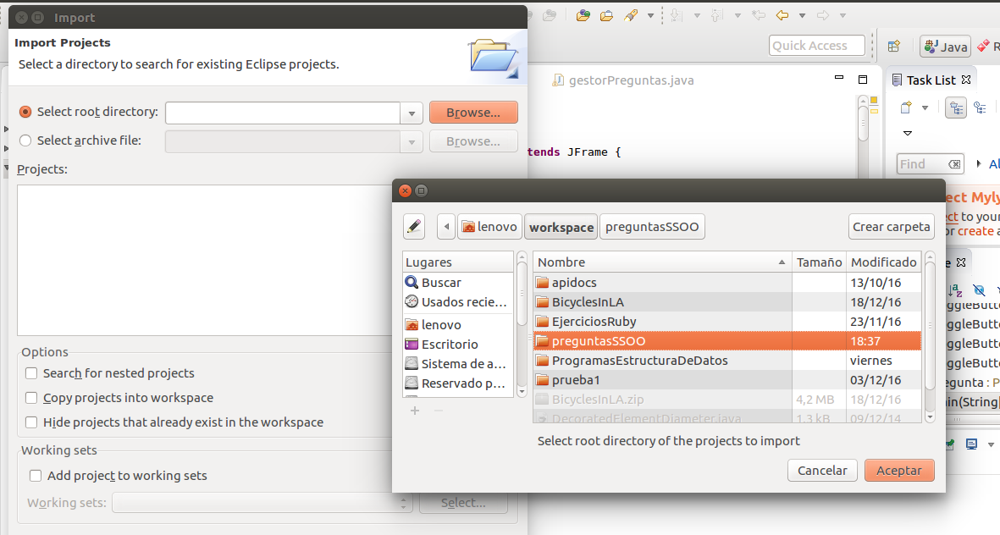
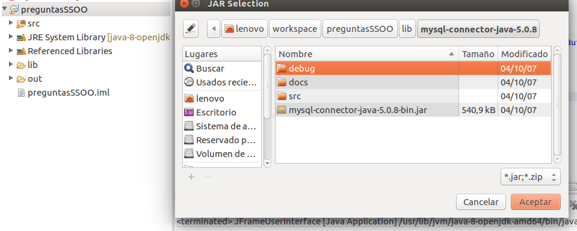
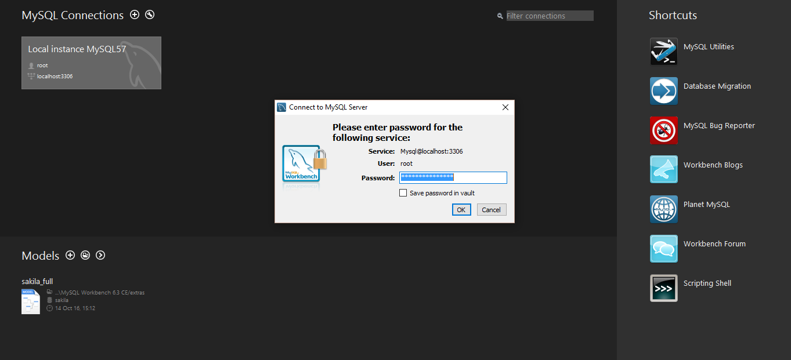
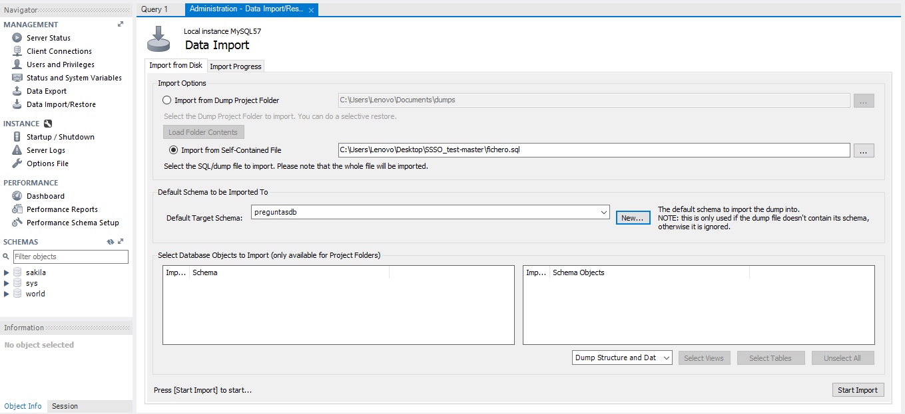
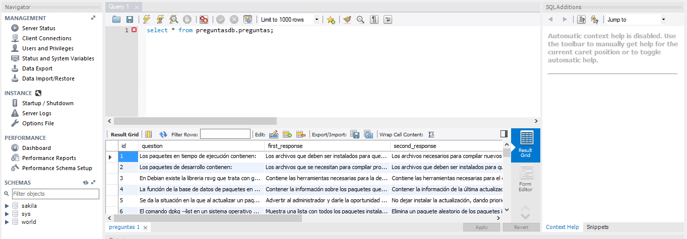

##**IMPORTAR PROYECTO EN ECLIPSE**

- 1º). Descargamos el proyecto y lo guardamos.

- 2º). Abrimos Eclipse. Click en File, Import, Existing project into Workspace.

- 3º). En Select Root Directory, hacemos click en Browse y seleccionamos la ubicacion de nuestro proyecto.

- 4º). Hacemos click en Finish y esperamos a que acabe de importar.

##**AÑADIR LA LIBRERIA DE MySQL A ECLIPSE**

Para que compile el proyecto, es necesario añadir la libreria que se encuentra en la carpeta lib. Para ello:

- Hacemos click derecho en el proyecto.

- Seleccionamos la opción Build Path - Add External archives.

- Seleccionamos el archivo `mysql-connector-java-5.0.8-bin.jar`, ubicado en `preguntasSSOO/lib/mysql-connector-java.5.0.8`

- Hacemos click en aceptar y la libreria queda importada.

##**COMO IMPORTAR Y EXPORTAR UNA BASE DE DATOS MySQL**

####*LINUX*

Para que el proyecto funcione, es necesario importar la base de datos `fichero.sql`. Para ello, lo primero que necesitamos es instalar `MySQL` en Linux. Procedemos de la siguiente forma:

- Ejecutamos `sudo apt-get update` para actualizar los repositorios instalados.

- Ejecutamos `sudo apt-get install mysql-server` para instalar MySQL.

- Una vez instalado MySQL, podemos importar nuestra base de datos como se muestra en el siguiente enlace:

[¿Cómo importar una base de datos MySQL?](https://gist.github.com/kamikaze-lab/98e901d961db59fd0db8)

####*WINDOWS*

- [Descargar MySQL](http://dev.mysql.com/downloads/installer/)

  - Elegimos la version `mysql-installer-community-5.7.17.0.msi` y damos a `Download`

- Una vez descargado, comienza la instalación. Elegimos la opción `Developer Default` y después `Execute`. Ahora esperamos a que se instalen todas las herramientas. 
  - En la pestaña de `Type and Networking`, en el campo `Config Type` dejamos la opción `Developer Machine`. Las demás opciones las dejamos por defecto. 
  
  - Introducimos una contraseña para la cuenta root. 
  
  - Las demás pestañas las dejamos por defecto y pulsamos `Excecute`.
  
  - Seguimos los pasos como nos indican hasta la finalización.

- Una vez instalado, abrimos MySQL Workbench. Ahora vamos a importar la base de datos de la siguiente forma:

  - Hacemos click en `Local instance MySQL57`, después en `connect` y escribimos nuestra contraseña root. 
  
  
  
  - Después seleccionamos en la lista de la izquierda `Data import/restore`. 
  
  - Seleccionamos el campo `Import from Self-Contained File` e importamos nuestro `fichero.sql`.
  
  - En `Default Target schema`, hacemos click en `New` y lo nombramos `preguntasdb`. 
  
  
  
  - Finalizamos la importación haciendo click en `Start Import`
  
  - Cerramos la pestaña y en la pestaña `Query 1` podemos escribir `select * from preguntasdb.preguntas;` y hacer click en el icono del rayo de la izquierda. Se ejecutará la consulta y nos devuelve una consulta con todas las entradas de la base de datos. De esta forma hemos completado correctamente la importación. 
  
  

##***Q&A***

- ¿Qué hacer si al ejecutar el programa en Eclipse sale el error `Error: No se ha encontrado la clase principal`?

  Estando situados en el archivo `JFrameUserInterface.java`, hacer click en la pestaña `Run`, elegir la opción `Run As` y después elegir la opción `Java Application`.
  
- ¿Qué hacer si sale: `Error random java.lang.NullPointerException` ?

#####*WINDOWS*

  - Comprobamos que hemos importado bien la base de datos. Para ello ejecutamos `cmd` y escribimos:
  
  `"C:\Program Files\MySQL\MySQL Server 5.7\bin\mysql.exe" -h localhost -u root -p`
  
  - Escribimos la password del root y pulsamos enter. Se nos abrirá la consola de MySQL. Probamos a escribir una petición como puede ser:
  
  `select * from preguntasdb.preguntas;`
  
  En el caso de que nos devuelva todos los registros de la tabla `preguntas` hemos importado bien la base de datos. Si nos da error, revisar la importación. 
  
  - Asegurarse de que el servidor MySQL está activo. 
  
  - Será necesario cambiar la siguiente configuración de la clase `Agente`:
  
    - En el atributo `user_db` poner la cadena de texto "root".
    
    - En el atributo `password` poner la password de nuestro root.
    
Si aun así sigue sin funcionar y da el mismo error, la solución consiste en crear un nuevo usuario, con nombre 'ivan' y con contraseña 'passwd' como se indica:

  - Abrimos `cmd` e iniciamos MySQL como usuarios root de la siguiente forma:
  
    `"C:\Program Files\MySQL\MySQL Server 5.7\bin\mysql.exe" -h localhost -u root -p`
    
  - Introducimos nuestra contraseña root y pasamos a la consola de MySQL. Ejecutamos la siguiente query:
  
   `CREATE USER 'ivan'@'localhost' IDENTIFIED BY 'passwd';`
   
  - Otorgamos privilegios al usuario de la siguiente forma:
  
   `GRANT ALL PRIVILEGES ON * . * TO 'ivan'@'localhost';`
   
   - Refrescamos los privilegios escribiendo:
   
   `FLUSH PRIVILEGES;`
   
   - Ejecutamos de nuevo el programa (con atributos `user_db="ivan"` y `password="passwd"`) y funciona.

#####*LINUX*

  - Comprobamos que hemos importado bien la base de datos. Escribimos en la terminal:
  
  `mysql -h localhost -u root -p`
  
  - Introducimos la contraseña del usuario root y hacemos una consulta como por ejemplo:
  
  `select * from preguntasdb.preguntas;`
  
  En el caso de que no nos devuelva todos los registros de la base de datos, revisar la importación.
  
  - Cambiamos en la clase `Agente` los campos indicado, asignando `user_db=root`y `password` con el valor de nuestra contraseña root.
  
  Si después de ejecutar la aplicacion con esta configuracion sigue saliendo el mismo error, la solucion es la siguiente:
  
  - En la terminal, ejecutamos el siguiente comando: 
  
  `mysql -h localhost -u root -p` e introducimos la contraseña del usuario root.
  
  - Introducimos la siguiente query en la linea de comandos:
  
   `CREATE USER 'ivan'@'localhost' IDENTIFIED BY 'passwd';`
   
  - Otorgamos privilegios al usuario de la siguiente forma:
  
   `GRANT ALL PRIVILEGES ON * . * TO 'ivan'@'localhost';`
   
   - Refrescamos los privilegios escribiendo:
   
   `FLUSH PRIVILEGES;`
   
   - Ejecutamos de nuevo el programa (con atributos `user_db="ivan"` y `password="passwd"`) y funciona.  
  
